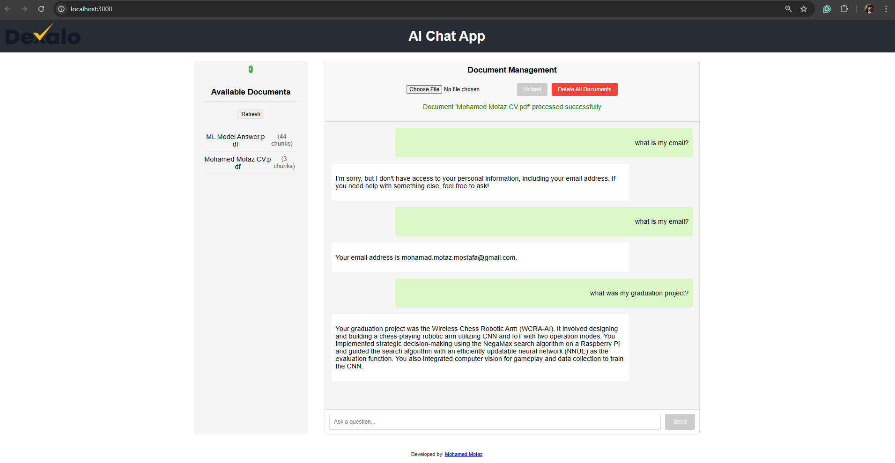
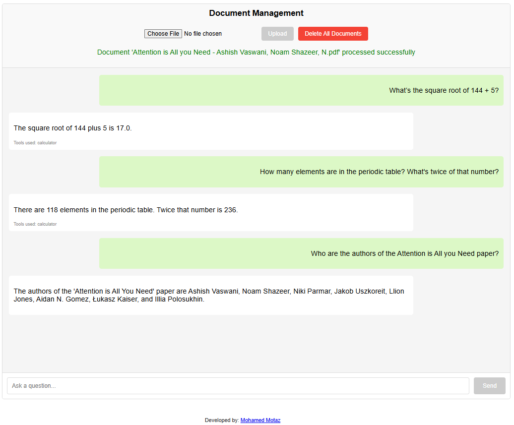

# AI_Chat_App
A simple RAG system useing FastAPI and React. This project allows users to upload documents and interact with a language model through a web interface. It also includes a calculator tool for performing calculations, and powerd by OpenAI API.

## Overview
This project is a simple Retrieval-Augmented Generation (RAG) system that allows users to interact with a language model through a web interface. It uses FAISS as a vector store to manage document embeddings curently using two tools: a calculator and a current date tool. The backend is built with FastAPI, while the frontend is developed using React.




# Project Structure
```bash
project/
├── backend/
│   ├── main.py                 # FastAPI app
│   ├── rag.py                  # RAG implementation
│   ├── agent.py                # LangChain agent with tools
│   ├── tools/
│   │   └── calculator.py       # Calculator tool implementation
│   │   └── currentDate.py      # Get current date tool implementation
│   └── requirements.txt        # Dependencies
└── frontend/
    ├── src/
    │   ├── App.js              # Main React app
    │   ├── components/
    │   │   ├── ChatWindow.js   # Chat UI component
    │   │   └── FileUpload.js   # Document upload component
    │   │   └── DocumentList.js # Document list component
    │   │   └── DocumentList.css # Document list styles
    │   └── api.js              # API calls to backend
    │   └── App.css             # Main styles
    │   └── index.js            # Entry point for React app
    │   └── index.css           # Global styles
    └── public/
    │    ├── index.html         # HTML template for React app
    │    ├── manifest.json      # Web app manifest
    │    └── dexalo-logo.png    # App logo
    └── package.json            # Frontend dependencies
```

# Installation
I highly recommend using a virtual environment to manage dependencies. You can follow this tutorial to set up a  [Python Virtual Environments](https://docs.python.org/3/library/venv.html) if you don't know how, after that you can use the following commands to install the dependencies.
   ```bash
   cd backend
   pip install -r requirements.txt
   cd ../frontend
   npm install
   ```

# Environment Variables
You need to set the following environment variables for the backend to work properly:
- `OPENAI_API_KEY`: Your OpenAI API key for accessing the language model. add this to your `.env` file in the main directory


# Usage
1. Start the FastAPI backend server:
   ```bash
   cd backend
   uvicorn main:app --reload
   ```
2. Start the React frontend server:
   ```bash
    cd frontend
    npm start
    ``` 

3. Open your web browser and go to `http://localhost:3000` to access the app.
4. Upload documents using the upload button in the app. The documents will be processed and stored in the vector store.
5. Use the chat interface to interact with the language model. You can ask questions about the uploaded documents or perform calculations using the calculator tool.
6. The app will display the responses from the language model, including answers to your questions and results from calculations.
7. You can also view the list of uploaded documents and their embeddings in the app.
8. To clear the document list, click the "Delete All Documents" button in the app. This will remove all uploaded documents and their embeddings from the vector store.
